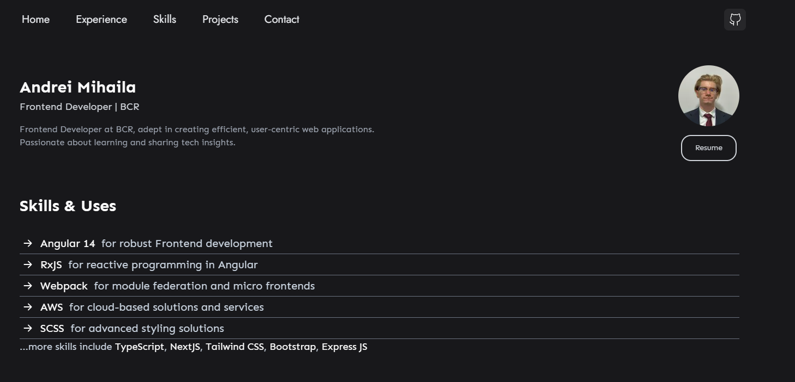

# Welcome to My Portfolio

Hello! I'm Andrei Mihaila, a Frontend Developer specializing in creating efficient, user-centric web applications.



You can view the live version of my portfolio here: [Live Demo](https://andreidorinm.com)

## Features

- Responsive design that looks great on both mobile and desktop screens.
- Interactive UI components for a better user experience.
- Showcases my latest projects, skills, and professional journey.

## Technology Stack

- **Next.js**: A React framework for production.
- **Tailwind CSS**: For styling the application.
- **GSAP**: For subtle yet powerful animations.

## Running Locally

To run this portfolio website on your local machine:

1. Clone the repository:
   ```bash
   git clone https://github.com/yourusername/portfolio-andreidorinm.git

2. Navigate to the project directory:
    ```bash
    cd portfolio-andreidorinm

3. Install the dependencies using Yarn:
    ```bash
    yarn install

4. Start the development server:
    ```bash
    yarn dev

## Inspiration

This project was inspired by [anurag](#)
